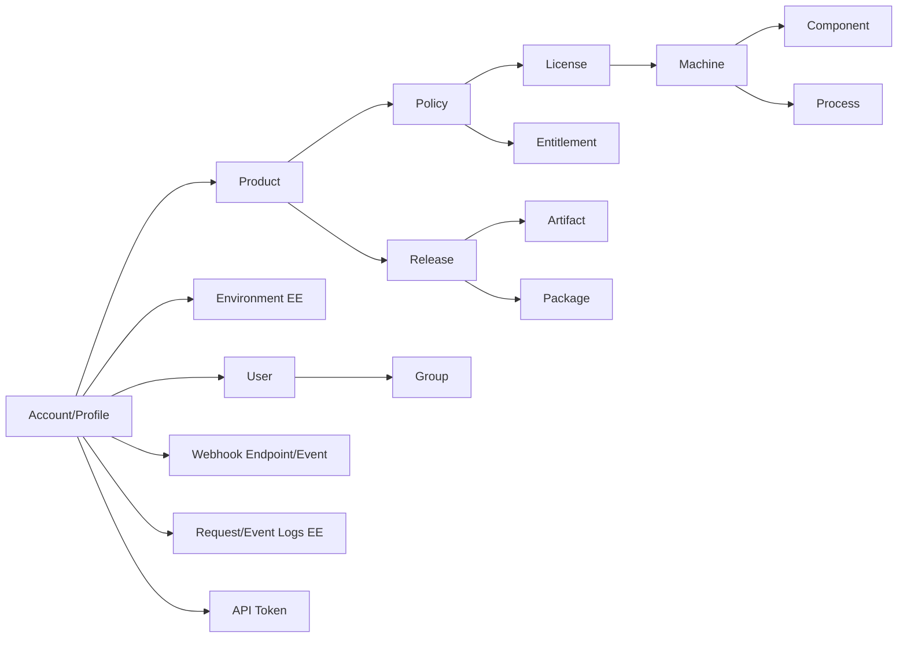

# `keygen` CLI（Rust）规划

> 一个面向 keygen.sh 的命令行工具：AI 调起来顺手、Boss 自己看也漂亮。

---

## 0. TL;DR

- **二进制名**：`keygen` 主名 + `kg` 别名（同一份代码、两个软链接；shim 检测 argv[0]）。
- **架构原则**：`keygen <resource> <action> [args] [flags]`，资源+动作扁平命令树，对 LLM 工具调用最友好。
- **支持三种部署目标**：
  1. **Official Cloud**：`https://api.keygen.sh`，路径强制 account-scoped。
  2. **Self-hosted CE**：用户指定 `--host`，**默认 singleplayer 模式**（路径无 account 前缀），可切多账户。
  3. **Self-hosted EE**：同上，但额外支持 environment、SSO、event/request logs 等 EE-only 特性。
- **认证**：`keygen login` 引导式拿到 token 写入 OS keyring；同时支持 `KEYGEN_TOKEN` / `--token` 直接注入（CI / AI agent 场景）。
- **AI 模式默认开启**：JSON 稳定输出 + 错误带 `hint`。**TTY 自动切换到 human 模式**（彩色表格 + spinner）。`--ai` / `--human` 可强制覆盖。
- **TUI 是一等公民**：`keygen tui` 进入 ratatui 全屏看板，资源浏览 / 实时日志 / 一键操作。
- **配置**：XDG 标准 — `~/.config/keygen/`、`~/.cache/keygen/`、`~/.local/share/keygen/`。

---

## 1. keygen.sh API 调研要点（决定 CLI 设计的部分）

### 1.1 协议骨架

| 维度 | 内容 |
|---|---|
| **风格** | JSON:API 1.0（`application/vnd.api+json`，也接受 `application/json`） |
| **Base URL（official）** | `https://api.keygen.sh/v1/accounts/<id-or-slug>` |
| **Base URL（self-hosted multi-player）** | `https://<host>/v1/accounts/<id-or-slug>` |
| **Base URL（self-hosted singleplayer）** | `https://<host>/v1`（**省略 account 段**） |
| **错误格式** | `{ "errors": [ { "title", "detail", "code", "source": { "pointer", "parameter" } } ] }` |
| **认证 Header** | `Authorization: Bearer <token>` / `Authorization: License <key>` / Basic |
| **Content-Type** | 请求/响应都是 `application/vnd.api+json`，CLI 内部统一封装 |

### 1.2 Token 类型（权限不同，CLI 都要支持）

| Token 类型 | 用途 | 默认过期 | 在 CLI 中的角色 |
|---|---|---|---|
| `admin-token` | 全账户管理 | 永不（admin 改密会失效） | `keygen login` 用 user 邮箱密码换的就是 admin 类（如果是 admin 用户） |
| `environment-token` | 单 environment 全权（EE） | 永不 | EE 模式下 `keygen env switch <env>` 后切到该 token |
| `product-token` | 单产品全权 | 永不 | 服务端集成首选（CI/CD） |
| `user-token` | 用户自身资源 | 2 周 | 普通 user 登录默认结果 |
| `license-token` | 单 license（机器激活/心跳） | 同 license | 终端用户激活流程 |
| `activation-token` | 仅机器激活 | 短 | 终端 SDK 用，CLI 一般不直接持有 |

→ **CLI 设计影响**：
- `keygen login` **不存密码**，只存 token；登录时 `POST /tokens` Basic Auth(email:password)。
- `--as <token-kind>` 可在登录时指定；不指定则按账户身份默认。
- token 存 OS keyring（macOS Keychain / Windows Credential Manager / Linux Secret Service），fallback 到 `~/.config/keygen/credentials` (chmod 600)。

### 1.3 资源全景图



### 1.4 关键业务流程（决定 CLI 命令组合）

**A. 完整发牌流程**
1. `keygen product create --name "Foo"` → 拿 `product_id`
2. `keygen policy create --product <pid> --duration 365d --max-machines 3 --scheme ED25519_SIGN`
3. `keygen license create --policy <polid> --user <uid> --metadata customer=acme`
4. 发给客户 `license.key`
5. 客户端 `keygen license validate-key <key> --fingerprint <fp>`（or activate machine）

**B. 离线/不联网验证**
- `keygen license check-out <id> --include machine` → 拿 `.lic` 文件（带签名）
- 客户端用公钥本地验签

**C. Release 分发**
1. `keygen release create --product <pid> --version 1.2.3 --channel stable`
2. `keygen artifact upload <release-id> --file ./app.dmg --platform darwin --arch arm64`
3. `keygen release publish <id>`
4. 终端 `keygen release upgrade --product <pid> --current 1.2.0 --constraint ^1`

**D. 机器激活/心跳**
- `keygen machine activate --license <id> --fingerprint <fp> --platform darwin`
- `keygen machine ping <id>` 周期心跳
- `keygen machine deactivate <id>`

### 1.5 CE vs EE / Official 差异落到 CLI

| 能力 | Official | CE | EE |
|---|---|---|---|
| accounts API 路径 | 强制 scoped | 默认 singleplayer | 默认 singleplayer，可 multiplayer |
| environments | ✔ | ✘ | ✔ |
| event-logs / request-logs | ✔ | ✘ | ✔ |
| SSO / SAML | ✔ | ✘ | ✔ |
| OCI / Docker registry | ✔（部分） | ✘ | ✔ |
| import/export | ✔ | ✘ | ✔ |

→ CLI 用 **能力探测** 而非硬编码：启动时 `GET /v1/profile` 或 `/v1/whoami` 拿 `meta`，缓存 capability map；不支持的命令运行时直接报：

```
✗ environment: not supported on this deployment (CE)
  hint: upgrade to Keygen EE or use the official cloud
```

---

## 2. CLI 命令树（资源 + 动作模式）

### 2.1 顶层命令

```
keygen
├── login                          # 交互式登录，引导选 official/self-hosted
├── logout
├── whoami                         # GET /profile，显示当前 token + capabilities
├── config                         # profile/host/output 等配置
│   ├── set <key> <value>
│   ├── get <key>
│   ├── list
│   └── path                       # 打印配置/凭据文件位置
├── profile                        # 多 profile 切换（dev / prod / customer-A）
│   ├── list
│   ├── use <name>
│   ├── add <name>
│   └── remove <name>
├── env                            # EE only: environment 切换
│   ├── list
│   ├── use <id>
│   └── current
├── tui                            # ratatui 全屏看板（资源浏览 / 实时事件 / 操作面板）
├── schema                         # 输出 CLI 全部命令的 JSON schema（给 AI 自省）
├── doctor                         # 检测 host 可达、token 有效、能力探测
└── completion <shell>             # bash/zsh/fish/powershell 补全
```

### 2.2 资源动作（统一形态）

每个资源都遵守这套子命令骨架，**这是 AI-Friendly 的关键**：

```
keygen <resource> list      [--filter k=v ...] [--limit N] [--page N] [--sort field] [--include rel]
keygen <resource> get       <id> [--include rel]
keygen <resource> create    [--from-file <json>] [--<attr> ...]
keygen <resource> update    <id> [--from-file <json>] [--<attr> ...]
keygen <resource> delete    <id> [--yes]
keygen <resource> <action>  <id> [...]   # 资源专属动作
```

### 2.3 完整资源 + 动作矩阵

| Resource | CRUD | 专属动作 |
|---|---|---|
| `token` | ✔ | `regenerate <id>` |
| `product` | ✔ | `tokens <id>` |
| `policy` | ✔ | `entitlements attach/detach/list <id>` |
| `license` | ✔ | `validate <id>`、`validate-key <key>`、`suspend`、`reinstate`、`renew`、`revoke`、`check-out`、`check-in`、`usage incr/decr/reset`、`tokens <id>`、`transfer <id> --to-user/policy` |
| `entitlement` | ✔ | — |
| `user` | ✔ | `ban`、`unban`、`reset-password`、`update-password`、`groups attach/detach` |
| `group` | ✔ | `users attach/detach`、`licenses list <id>` |
| `machine` | ✔ (`activate/deactivate` 别名 `create/delete`) | `ping <id>`、`reset <id>`、`check-out <id>`、`components list/get/...`、`processes list/spawn/kill/ping` |
| `component` | ✔ | — |
| `process` | ✔ | `spawn`、`kill`、`ping <id>` |
| `release` | ✔ | `publish`、`yank`、`unpack`、`upgrade --product --current`、`constraints attach/detach`、`packages attach/detach` |
| `artifact` | ✔ | `upload <release> --file`、`download <id> [--out path]`、`yank` |
| `package` | ✔ | — |
| `webhook` | ✔ (`endpoint` 子组) | `endpoint test <id>`、`event list`、`event retry <id>` |
| `environment` | ✔ (EE) | `tokens <id>` |
| `request-log` (EE) | list/get | — |
| `event-log` (EE) | list/get | — |

> 命名一律用 **kebab-case**，与 API 字段保持一致；attribute flag 自动从 OpenAPI/JSON:API 字段生成（`--max-machines`、`--require-check-in` 等）。

### 2.4 通用全局 flags

```
--profile <name>          # 切换配置档
--host <url>              # 临时覆盖 host（self-hosted 调试）
--account <id|slug>       # 临时覆盖账户
--token <token>           # 临时注入 token（优先级最高）
--env <env-id>            # EE: 临时切 environment
--output table|json|yaml|tsv|ndjson   # 默认：TTY=table，非 TTY=json
--no-color                # 关闭颜色（CI/AI 场景常用）
--quiet / -q              # 仅输出关键结果（id/key 等）
--verbose / -v            # 打印请求/响应（调试）
--ai                      # 强制 AI 模式（JSON + hint + 无色无 spinner）；非 TTY 默认开
--human                   # 强制 human 模式（彩色表格 + spinner）；TTY 默认开
--dry-run                 # 仅打印将要发出的请求
--idempotency-key <k>     # 写操作幂等
--timeout <secs>
--retry <n>
--include <rel,rel>       # JSON:API include
--filter <k=v>            # 多次使用拼 ?filter[k]=v
```

### 2.5 输入便利

- **`--from-file -`** 接 stdin JSON / `--from-file foo.json` 接文件 → 直接做 PATCH/POST body，绕过 flag 海洋。AI 一次性给完整 JSON 比拼一堆 flag 干净。
- **`--metadata k=v` 多次** → 转成 `meta.<k>`。
- **`--set attrs.maxMachines=5`** JSONPath 风格覆盖。
- 日期支持 ISO8601 + 相对值（`30d`、`2h`、`now+1y`）。

---

## 3. AI-Friendly 设计

### 3.1 三件套

1. **`keygen schema --format json`** 输出全命令树 JSON Schema（resource、action、params、flags、enum），AI 用它构造调用而无需读 `--help`。
2. **`--output json` 稳定 schema**：
   - 单条：`{ "ok": true, "data": { ... } }`
   - 列表：`{ "ok": true, "data": [...], "meta": { "page", "limit", "total" } }`
   - 错误：`{ "ok": false, "error": { "code", "title", "detail", "source", "http_status" } }`
   - **退出码**：0 成功 / 1 用户错（4xx）/ 2 服务器错（5xx）/ 3 网络错 / 4 认证错 / 5 capability 不支持
3. **`--ai` 模式预设**：JSON、不上色、无 spinner、错误带 `hint` 字段告诉 AI 下一步可能的修复命令。**非 TTY 默认开启**，省去 AI agent 显式传 flag。

### 3.4 模式判定规则（TTY vs AI）

| 场景 | 默认模式 | 输出 | 颜色 | spinner | 错误 hint | 交互 prompt |
|---|---|---|---|---|---|---|
| 终端直接跑（isatty） | human | table | ✔ | ✔ | ✘ | ✔ |
| 管道 / 脚本 / `claude code` | ai | json | ✘ | ✘ | ✔ | ✘（缺参数直接报错） |
| `--ai` 显式 | ai | json | ✘ | ✘ | ✔ | ✘ |
| `--human` 显式 | human | table | ✔ | ✔ | ✘ | ✔ |
| `CI=true` 环境变量 | ai | 同上 | — | — | — | — |

### 3.2 自描述能力

- `keygen <resource> --explain` → 返回该资源的字段说明 + 示例 JSON。
- `keygen explain error <code>` → 把 keygen API 错误码翻译成人话 + 修复建议（内嵌一份错误码 → 提示映射表）。

### 3.3 幂等 & 安全

- 所有写操作支持 `--idempotency-key`。
- `delete/revoke/yank` 默认要求 `--yes` 或 stdin 是 TTY 时弹 `[y/N]`，AI 模式下必须显式 `--yes`。

---

## 4. Human-Friendly 设计

### 4.1 视觉

- **状态色**：`ACTIVE`=绿、`EXPIRING`=黄、`EXPIRED/SUSPENDED`=橙、`BANNED/REVOKED`=红、`INACTIVE`=灰；用 unicode 圆点 `●` 前缀。
- **表格**：`comfy-table` UTF8_FULL preset，自动列裁剪，超长 id 显示前 8 + `…`。
- **时间**：`humantime` "3 days ago" / "in 2 months"，`-v` 时显示完整 ISO。
- **金额/计数**：千分位。
- **链接**：终端支持 OSC 8 时输出 hyperlink 到 keygen dashboard。
- **Spinner**：`indicatif`，写操作 + 列表分页拉取时显示。
- **上传/下载**：`indicatif` 带速率/ETA 进度条；artifact 大文件用分片 + 多 part 上传。

### 4.2 交互

- `keygen login` 用 `inquire`：选 deployment 类型 → 输 host → 输 account → email → password（隐藏） → 选 token kind → 测试连接 → 写 keyring。
- 列表分页：TTY 模式自动 `less` like 翻页，提示 `↑↓ q`，pipe 模式直接输出全部。
- `keygen license create` 末尾把 `.key` **同时写到剪贴板**（可选），并打印 "Key copied to clipboard"。

### 4.3 友好错误

```
✗ License is suspended (LICENSE_SUSPENDED)
  detail   : This license has been suspended by an administrator.
  source   : pointer=/data/attributes/suspended
  hint     : run `keygen license reinstate <id>` to restore
  request  : POST /v1/accounts/acme/licenses/abc/actions/validate
  trace-id : 01HZ...
```

---

## 5. 配置 & 凭据存储（XDG）

### 5.1 路径

| 路径 | XDG 变量 | 内容 |
|---|---|---|
| `~/.config/keygen/config.toml` | `$XDG_CONFIG_HOME` | profiles（host, account, default env, output 默认值） |
| OS keyring entry `keygen:<profile>` | — | token（首选） |
| `~/.local/share/keygen/credentials.toml` | `$XDG_DATA_HOME` | keyring 不可用时 fallback（chmod 600） |
| `~/.cache/keygen/capabilities.json` | `$XDG_CACHE_HOME` | 能力探测缓存（TTL 1 天） |
| `~/.cache/keygen/schema.json` | `$XDG_CACHE_HOME` | API schema 缓存（用于自描述） |
| `~/.local/state/keygen/history.log` | `$XDG_STATE_HOME` | TUI 操作历史 |

### 5.2 `config.toml` 示例

```toml
default_profile = "prod"

[profiles.prod]
deployment = "official"          # official | ce | ee
host       = "https://api.keygen.sh"
account    = "acme"
output     = "table"

[profiles.local-ce]
deployment = "ce"
host       = "https://licensing.example.com"
mode       = "singleplayer"      # singleplayer | multiplayer
output     = "json"
```

### 5.3 优先级（覆盖顺序）

`--token / --host / --account flag` > 环境变量 (`KEYGEN_TOKEN`/`KEYGEN_HOST`/`KEYGEN_ACCOUNT`) > 当前 profile > `default_profile`。

---

## 6. 项目骨架（Rust）

### 6.1 依赖（关键 crates）

| 用途 | crate |
|---|---|
| CLI 解析 | `clap` v4 derive + `clap_complete` |
| HTTP | `reqwest` (rustls) + `tokio` |
| 序列化 | `serde` / `serde_json` / `toml` / `serde_yaml` |
| 凭据 | `keyring` |
| 配置路径 | `directories` |
| 表格 | `comfy-table` |
| 颜色 | `owo-colors` + `supports-color` |
| 进度 | `indicatif` |
| 交互 | `inquire` |
| TUI | `ratatui` + `crossterm` + `tui-input` + `tui-tree-widget` + `throbber-widgets-tui` |
| 时间 | `time` / `humantime` / `jiff`（任选其一） |
| 日志 | `tracing` + `tracing-subscriber` |
| 错误 | `thiserror` + `miette`（漂亮错误） |
| URL | `url` |
| 文件上传 | `reqwest` multipart + `tokio::fs` |

### 6.2 模块划分

```
keygen-cli/
├── Cargo.toml
├── src/
│   ├── main.rs
│   ├── cli/                    # clap derive 定义
│   │   ├── mod.rs
│   │   ├── globals.rs          # 全局 flags
│   │   └── resources/          # 每资源一个文件
│   │       ├── license.rs
│   │       ├── machine.rs
│   │       ├── ...
│   ├── api/                    # HTTP 层
│   │   ├── client.rs           # reqwest 封装 + JSON:API request/response
│   │   ├── auth.rs             # Authorization header 拼装
│   │   ├── error.rs            # ApiError + status code → exit code 映射
│   │   ├── jsonapi.rs          # Document/Resource/Relationship 类型
│   │   └── pagination.rs
│   ├── resources/              # 资源 = 数据 model + actions 实现
│   │   ├── license/
│   │   │   ├── model.rs        # LicenseAttrs serde
│   │   │   ├── commands.rs     # list/get/create/.../validate/suspend...
│   │   │   └── render.rs       # 表格列、状态着色
│   │   └── ...
│   ├── auth/
│   │   ├── login.rs            # 交互式登录 flow
│   │   ├── store.rs            # keyring + fallback file
│   │   └── token.rs
│   ├── config/
│   │   ├── profile.rs
│   │   └── file.rs
│   ├── output/
│   │   ├── mod.rs              # OutputFormat + Renderer trait
│   │   ├── table.rs
│   │   ├── json.rs
│   │   ├── yaml.rs
│   │   └── ndjson.rs
│   ├── render/
│   │   ├── status.rs           # 状态 → 颜色/图标
│   │   ├── time.rs             # 相对时间
│   │   └── progress.rs
│   ├── capability/             # CE/EE/official 能力探测
│   │   └── detect.rs
│   ├── schema/                 # `keygen schema` 输出
│   │   └── generate.rs
│   ├── tui/                    # ratatui 全屏看板
│   │   ├── mod.rs              # 主循环、event loop
│   │   ├── app.rs              # 全局状态
│   │   ├── theme.rs            # 配色（与 CLI render 共享 status 色板）
│   │   ├── views/
│   │   │   ├── home.rs         # 资源选择面板（左侧树）
│   │   │   ├── list.rs         # 通用列表（复用 resources 的 columns 定义）
│   │   │   ├── detail.rs       # 资源详情 + 关联资源（include）
│   │   │   ├── actions.rs      # 动作面板（validate/suspend/...）
│   │   │   └── events.rs       # webhook 事件实时流
│   │   └── widgets/
│   │       ├── status_pill.rs
│   │       ├── kv_table.rs
│   │       └── log_viewer.rs
│   └── lib.rs
└── tests/
    ├── e2e/                    # 用 mockito/wiremock 录制官方响应
    └── integration/
```

### 6.3 资源命令的统一抽象

```rust
trait ResourceCommand {
    type Attrs: Serialize + DeserializeOwned;
    const TYPE: &'static str;        // "licenses"
    const PATH: &'static str;        // "licenses"
    fn columns() -> Vec<Column>;     // 表格列定义
    fn render_status(&self) -> StyledString; // 状态色
}
```

→ list/get/create/update/delete 全部走泛型实现，资源只负责声明字段；专属动作（validate/suspend/...）单独写。

---

## 6.4 项目落地位置 & 仓库

- **本地路径**：`/Users/5km/Dev/Rust/keygen-cli/`
- **GitHub 仓库**：`okooo5km/keygen-cli`（开源，MIT 协议）
- **Homebrew 二进制名**：`keygen-cli`（避免和 keygen.sh 官方任何潜在 formula 重名；用户安装后仍以 `keygen` / `kg` 调用，靠 formula `bin.install` 同时部署两个软链接）

---

## 7. CI/CD（参考 pngoptim 模板）

完整复刻 `/Users/5km/Dev/Rust/pngoptim/.github/workflows/` 套路，去掉 XCFramework / swift-package 部分（不需要）。

### 7.1 `.github/workflows/ci.yml`

PR / push 到 `main` 触发。三个 job：

| Job | Runner | 步骤 |
|---|---|---|
| `test` | ubuntu-latest + macos-latest matrix | checkout → toolchain stable → cargo cache → `cargo test --workspace` → `cargo build --release` → `./target/release/keygen --version` |
| `clippy` | ubuntu-latest | `cargo clippy --workspace -- -D warnings` |
| `fmt` | ubuntu-latest | `cargo fmt --all -- --check` |

### 7.2 `.github/workflows/release.yml`

`v*` tag 触发，多平台构建 + 发布 + Homebrew 推送。

| Job | Runner | 产物 |
|---|---|---|
| `build-macos` | macos-latest | `aarch64-apple-darwin` + `x86_64-apple-darwin` 用 `lipo` 合并成 universal → `keygen-cli_<ver>_darwin_universal.tar.gz` |
| `build-linux-x86_64` | ubuntu-latest | `keygen-cli_<ver>_linux_x86_64.tar.gz` |
| `build-linux-arm64` | ubuntu-24.04-arm | `keygen-cli_<ver>_linux_arm64.tar.gz` |
| `build-windows` | windows-latest | `keygen-cli_<ver>_windows_x86_64.zip` |
| `release` | ubuntu-latest | `gh release create` 上传所有 tar/zip + sha256 |
| `homebrew` | ubuntu-latest（pre-release tag 跳过） | 推 formula 到 `okooo5km/homebrew-tap` |

每个产物配套 `.sha256` 文件，与 pngoptim 保持一致。

### 7.3 Homebrew Formula 自动推送

逻辑照抄 pngoptim release.yml 的 `homebrew` job：

1. 下载 `macos-universal` artifact，读 sha256。
2. clone `https://github.com/okooo5km/homebrew-tap`（用 `HOMEBREW_TAP_TOKEN` secret，已存在，复用）。
3. 写 `Formula/keygen-cli.rb`：

```ruby
class KeygenCli < Formula
  desc "AI-friendly CLI for keygen.sh — manage products, policies, licenses, machines, releases"
  homepage "https://github.com/okooo5km/keygen-cli"
  url "https://github.com/okooo5km/keygen-cli/releases/download/v#{VERSION}/keygen-cli_#{VERSION}_darwin_universal.tar.gz"
  sha256 "#{SHA256}"
  version "#{VERSION}"
  license "MIT"

  def install
    bin.install "keygen"
    bin.install_symlink bin/"keygen" => "kg"   # 短别名
  end

  def caveats
    <<~EOS
      Run `keygen login` to authenticate, or set KEYGEN_TOKEN.
      Short alias: `kg` (symlink to `keygen`).
      Shell completion: `keygen completion zsh > ~/.zfunc/_keygen`
    EOS
  end

  test do
    assert_match "keygen", shell_output("#{bin}/keygen --version")
    assert_match "keygen", shell_output("#{bin}/kg --version")
  end
end
```

4. commit + push，用户 `brew tap okooo5km/tap && brew install keygen-cli` 即可。

### 7.4 还需要的 GitHub 配置

- **Secrets**：`HOMEBREW_TAP_TOKEN`（已有，复用 pngoptim 同款）。无需 swift / xcframework 相关 token。
- **Repo settings**：`Settings → Actions → Workflow permissions = Read and write`（让 release job 能创建 release）。
- **Branch protection**：`main` 强制 PR + 必须 ci 通过（test/clippy/fmt 三项）。
- **Issue / PR 模板**：从 pngoptim 的 `.github/ISSUE_TEMPLATE/` 和 `pull_request_template.md` 复制改文案。

### 7.5 版本与发布节奏

- `Cargo.toml` 版本与 `git tag` 保持一致。
- 发版流程：bump `Cargo.toml` → `cargo build` 更新 lock → commit → `git tag v0.1.0 && git push --tags` → CI 自动跑完。
- pre-release（带 `-` 的 tag，如 `v0.2.0-rc.1`）跳过 Homebrew，仅出 GitHub Release。

---

## 8. 测试 & 发布（其他细节）

- **单元测试**：JSON:API 解析、attr flag 转 body、错误映射。
- **集成测试**：`wiremock` mock keygen API，覆盖三种部署 + 主要 token 类型 + 翻页 + 错误。
- **冒烟测试**：可选 `KEYGEN_E2E=1` 跑一组 official 沙盒账户的真实调用（CI secret）。
- **跨平台**：macOS arm64/x64、Linux x64/arm64、Windows x64；用 `cargo-dist` 出 release。
- **包管理**：Homebrew tap、cargo install、winget、apt deb（cargo-deb）。

---

## 9. 实现拆分（建议落地顺序）

按依赖关系排，每块基本独立：

0. **仓库初始化**：在 `/Users/5km/Dev/Rust/keygen-cli/` `cargo new` → 复制 pngoptim 的 `.github/workflows/{ci,release}.yml` 改文案 → 复制 ISSUE_TEMPLATE/PR template → MIT LICENSE + README + CLAUDE.md → 推到 `okooo5km/keygen-cli` → 配 branch protection。
1. **骨架**：`clap` 命令树 + 全局 flags + config 文件读写 + profile 切换。
2. **HTTP & JSON:API client**：错误映射、退出码、`--dry-run`、`--verbose`。
3. **认证**：`login`/`logout`/`whoami` + keyring 存储 + Bearer/License header。
4. **能力探测 & host 解析**：official / CE-singleplayer / EE-multiplayer 路径计算。
5. **核心资源 CRUD**：先 license / machine / policy / product（覆盖 80% 调用）。
6. **license 专属动作**：validate / suspend / reinstate / renew / revoke / check-out / check-in / usage。
7. **输出层**：table / json / yaml / ndjson + 状态色 + 时间渲染。
8. **机器活动**：activate / ping / reset / check-out + components/processes。
9. **distribution**：release / artifact upload+download（带进度）/ package。
10. **users / groups / entitlements**。
11. **webhooks**：endpoint + event + retry。
12. **EE 专属**：environment / event-log / request-log，加 capability 守卫。
13. **AI 三件套**：`schema`、`--explain`、`explain error`、稳定 JSON 输出冻结。
14. **TUI**（`keygen tui`）：
    - 阶段 a：左侧资源树 + 右侧 list view（复用 CLI 的 columns 定义）。
    - 阶段 b：detail view + 动作面板（在 license 上按 `s` 触发 suspend、`v` validate、`r` renew）。
    - 阶段 c：实时事件流（轮询 `webhook-events` 或 EE 的 `event-logs`），状态变化高亮。
    - 阶段 d：命令面板（`:` 进入，类似 vim/k9s），把任意 CLI 命令在 TUI 内执行。
15. **打磨**：补全脚本、Homebrew、cargo-dist、文档站。

---

## 10. 已拍板（Boss 5/8 反馈）

| # | 决定 |
|---|---|
| 1 | 二进制名：`keygen` 主名 + `kg` 别名（同一份代码，靠 argv[0] 分流） |
| 2 | 配置目录：XDG 标准 |
| 3 | 离线验签：v1 不做 |
| 4 | TUI：要做，作为一等公民模块 `keygen tui`，与 CLI 共享 columns/状态色 |
| 5 | AI 模式：默认开启（非 TTY 自动；TTY 自动切 human；可 `--ai`/`--human` 显式覆盖） |
| 6 | 项目目录：`/Users/5km/Dev/Rust/keygen-cli/` |
| 7 | 仓库：`okooo5km/keygen-cli`，开源 MIT |
| 8 | CI/CD + Homebrew：完整复刻 pngoptim 模板，去掉 xcframework，formula 名 `keygen-cli`，安装 `keygen` + `kg` 两个软链接 |
